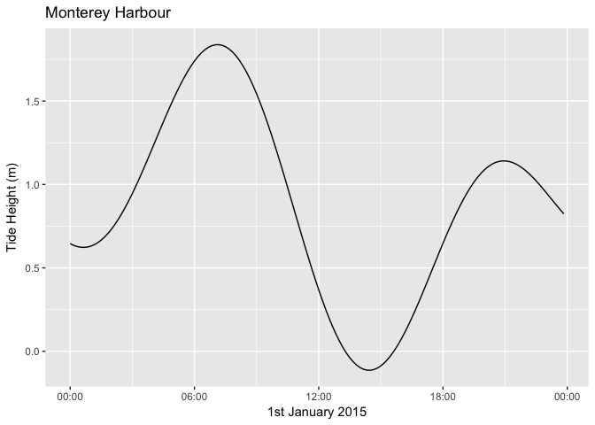

<!-- README.md is generated from README.Rmd. Please edit that file -->
rtide
=====

`rtide` is an R package to calculate tide heights based on tide station harmonics.

It includes the harmonics for 637 US reference stations.

Usage
-----

``` r
library(rtide)
#> rtide is not suitable for navigation

data <- rtide::tide_height(
  "Monterey Harbor", from = as.Date("2015-01-01"), to = as.Date("2015-01-01"), 
  minutes = 10L, tz = "PST8PDT")

print(data)
#> Source: local data frame [144 x 3]
#> 
#>                                  Station            DateTime TideHeight
#>                                    (chr)              (time)      (dbl)
#> 1  Monterey, Monterey Harbor, California 2015-01-01 00:00:00  0.6452338
#> 2  Monterey, Monterey Harbor, California 2015-01-01 00:10:00  0.6353040
#> 3  Monterey, Monterey Harbor, California 2015-01-01 00:20:00  0.6281772
#> 4  Monterey, Monterey Harbor, California 2015-01-01 00:30:00  0.6240083
#> 5  Monterey, Monterey Harbor, California 2015-01-01 00:40:00  0.6229294
#> 6  Monterey, Monterey Harbor, California 2015-01-01 00:50:00  0.6250485
#> 7  Monterey, Monterey Harbor, California 2015-01-01 01:00:00  0.6304487
#> 8  Monterey, Monterey Harbor, California 2015-01-01 01:10:00  0.6391874
#> 9  Monterey, Monterey Harbor, California 2015-01-01 01:20:00  0.6512954
#> 10 Monterey, Monterey Harbor, California 2015-01-01 01:30:00  0.6667771
#> ..                                   ...                 ...        ...
```

``` r
library(ggplot2)
library(scales)
```

``` r
ggplot(data = data, aes(x = DateTime, y = TideHeight)) + 
  geom_line() + 
  scale_x_datetime(name = "1st January 2015", 
                   labels = date_format("%H:%M", tz="PST8PDT")) +
  scale_y_continuous(name = "Tide Height (m)") +
  ggtitle("Monterey Harbour")
```



Installation
------------

To install and load the development version from GitHub

    devtools::install_github("rtide")
    library(rtide)
